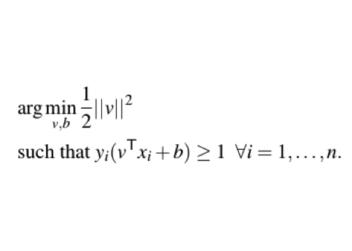
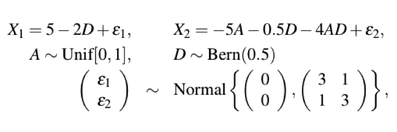

--- 
title       : Multivariate Pattern Analysis and Confounding in Neuroimaging
subtitle    : 
author      : Kristin Linn
job         : March 6, 2015
framework   : io2012        # {io2012, html5slides, shower, dzslides, ...}
highlighter : prettify      # {highlight.js, prettify, highlight}
hitheme     : tomorrow      # 
widgets     : [mathjax]            # {mathjax, quiz, bootstrap}
mode        : selfcontained # {standalone, draft}
knit        : slidify::knit2slides
---

## Roadmap
========================================================

- Motivate and define the goals of Multivariate Pattern Analysis (MVPA)
- Demonstrate the consequences of confounding
- Inverse probability weighting to address confounding in MVPA
- Simulated and real data examples

--- 

## How does disease affect brain structure?
========================================================

### "Mass-univariate" approaches test for group differences at each voxel 
- e.g., Statistical Parametric Mapping, Voxel-based morphometry

--- 

## Multivariate Pattern Analysis (MVPA)
========================================================

### Any tool that can identify joint disease patterns across the brain.

- SVM 
- Logistic regression
- Scalar on image regression

### __MVPA goals__:

1. Study structural patterns in the brain that characterize disease
2. Develop image-based disease biomarkers

--- &twocoltop

## Support Vector Machine (SVM)
========================================================

*** {name: left}

*** {name: right}

*** {name: bottom}

### In neuroimaging each point is a brain, classes are cases/controls

^http://docs.opencv.org/doc/tutorials/ml/introduction_to_svm/introduction_to_svm.html

--- 

## MVPA using the SVM
========================================================

### The SVM returns a vector of weights, one per voxel/region 
- Weights indicate relative contribution to the discrimative rule
  

--- 

## Marginal vs Joint MVPA
========================================================

### Non-imaging variables can be informative about disease process

- Investigators must decide whether or not to include non-image variables as features 

- We define Marginal MVPA to be any MVPA that uses only the image

- We define Joint MVPA to be any MVPA that uses image and non-image variables

--- 

## Confounding in Neuroimaging
========================================================

### A confounder is a non-image variable that affects both disease and image
- e.g., In Alzheimer's disease age is associated with diagnosis and atrophy

### Recall the goals of MVPA:
1. Study structural patterns in the brain that characterize disease
2. Develop image-based disease biomarkers

### It is important the analysis reflect the target MVPA goal!
- This talk focuses on Goal 1 with brief comments about Goal 2

--- 

## Confounding and MVPA Goal 1
========================================================

### Goal: estimate the stuctural pattern that characterizes disease
- Ideally, observe each patient with and without disease
- In causal inference terms: want to see both potential outcomes

### Several problems: 
- Can't observe both potential outcomes
- Can't randomize disease
- Matching on all confounders may not be feasible
- Not addressing confounding may lead to a biased estimate of the disease pattern

---

## Confounding Toy Example
========================================================

--- &twocoltop

## Voxel-wise "adjustment"
========================================================

*** {name: left}

"Adjusted SVM"

*** {name: right}

"CN-Adjusted SVM"

*** {name: bottom}

### Note:
- Both methods are "conditional" on A
- Changes interpretation of features, i.e., now joint with A

--- &twocol

## Inverse Probability Weighting
========================================================

---

## Inverse Probability Weighting
========================================================

---

## IPW-MVPA
========================================================

### Idea: perform MVPA in the pseudo-population created by IPW 

- Define $W_{i} = I(D_{i}=1)\mbox{pr} (D_{i}=1 \mid {\boldsymbol A}_{i}) + I(D_{i}=0)\mbox{pr} (D_{i}=0 \mid {\boldsymbol A}_{i})$

- Weight each subject by $W_{i}^{-1}$ 

### Usually IP weights are unknown and must be estimated 
- Logistic regression: 
$$
\mbox{logit}[ \mbox{pr} (D=1 \mid {\boldsymbol A})] = \beta_{0} + \beta_{1}^{T}{\boldsymbol A}
$$
- Obtain $\widehat{W}_{i}$ by plugging in 
$$\widehat{\mbox{pr}} (D_{i}=1 \mid {\boldsymbol A}_{i}) = \widehat{\beta}_{0} + \widehat{\beta}_{1}^{T}{\boldsymbol A}
$$

--- &twocol

## IPW-SVM
========================================================

### Soft-margin SVM

- Weight the slack variables $\xi_{i}$ by IP weights
- Extension of class imbalance weighting 

*** {name: left}

*** {name: right}

--- 

## IPW-SVM in R
========================================================

### To our knowledge, no SVM package allows subject-level weights 

- Approximate IPW-SVM:
  1. Estimate the IP weights and define $\widehat{T}_{i}$ to be the estimated weight for subject $i$ rounded to the nearest integer.
  2. Create a new dataset that contains $\widehat{T}_{i}$ copies of subject $i$'s data vector, $(Y_{i}, X_{i}, A_{i})$.
  3. Train the SVM in the new dataset.

---

## Simulations
========================================================

- Generate 2,000 samples, save half for testing
- Learn SVM on 1,000 training samples to get "true" weights
- Take a biased subsample (n=200 per class) from the 1,000 training samples
- Compare methods on the biased subsample  

---

## Marginal MVPA Results
========================================================

--- 

## Joint MVPA Results
========================================================

---

## Joint MVPA Results 
========================================================

- $X_{1} = 5 - 3D + \epsilon_{1}$
- $X_{2} = -3A - 4D + 3AD + \epsilon_{2}$

--- 

## Caveat
========================================================

- Can't weight slack variables when the data are linearly separable!
- Data become more separable as $p$ increases and are always perfectly linearly separable when $p > n$. 

---

## Caveat
========================================================

---

## Current solution: PCA-IPW-SVM
========================================================

  1. Estimate the IP weights and create the new dataset that contains subject-level copies
  2. Do PCA on the image features in the new dataset
  3. Train SVM on the first several PC scores

---

## Results from ADNI data
========================================================

- 137 ROI volumes
- Used an age-matched sample to estimate the "true" weights for classifying Alzheimer's vs. controls
- Performed PCA-IPW-SVM on a biased subsample of the full age-matched sample

---

## Thank you!
========================================================

### Questions?
